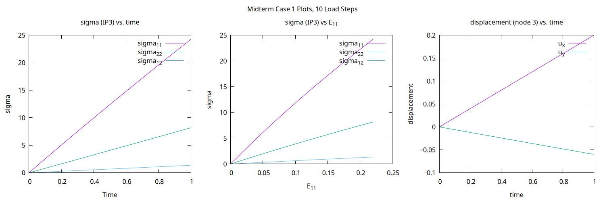
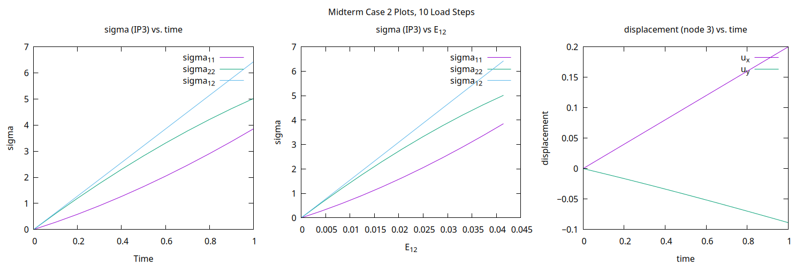

# Code for ME 661 - Nonlinear FEM
## Building and Running the Code
First, install GNUPlot with
```
sudo apt-get install gnuplot
```

To build the code (assuming Linux):
```
git clone git@github.com:smtobin/NLFEM.git
cd NLFEM
mkdir build
cd build
cmake ..
make
```
This will create an executable `NLFEM` in the `build/` directory, which takes the path to an input file as input.
```
./NLFEM ../input/linear_fem.txt
```
## Midterm Assignment
The Midterm assignment consists of multiple cases.

Case 1 is a 1x1 quadrilateral element with pin joints on its two left nodes with prescribed x displacements on its two right nodes, letting the y DOF on the two right nodes be free.

Case 2 is a 1x1 quadrilateral element with pin joints on its two bottom nodes with prescribed x displacements on its two top nodes, letting the y DOF on the two tops nodes be free. 

Each case has their own input file, each with two versions for 10 load steps and 20 load steps:
```
./NLFEM ../input/midterm1_10steps.txt
./NLFEM ../input/midterm1_20steps.txt
./NLFEM ../input/midterm2_10steps.txt
./NLFEM ../input/midterm2_20steps.txt
```
The code will print out the residual for each Newton-Raphson iteration at each load step, as well as the current nodal displacements after each load step. It will also produce plots using GNUPlot.

### Plotting Results



## Linear FEM Assignment
The repository for Linear FEM: https://github.com/smtobin/NLFEM/tree/3b38613a801e5e5c18c425d65bef1809654b406a

## HW3
The repository for HW3: https://github.com/smtobin/NLFEM/tree/d4e3f46f18a2723ba919e170b7eca36f22bb4d5b

## Input File Format
The input files specify the material, mesh nodes, mesh elements, prescribed displacements and prescribed forces. An example input file is below:
```
# material - only option is "Midterm"
m Midterm

# number of load steps
l 10

# nodes - index, x, y
n 0 0.5 0.5
n 1 -0.5 0.5
n 2 -0.5 -0.5
n 3 0.5 -0.5

# elements - n1, n2, n3, n4
e 0 1 2 3

# displacement BC - node index, axis (x or y), displacement
d 0 x 0.01
d 1 x 0
d 2 x 0
d 3 x 0.01
d 3 y 0

# force BC - node index, axis (x or y), force
# example: f 0 x 10
# f 0 x 1.655
# f 1 x -1.655
# f 2 x -1.655
# f 3 x 1.655
```
